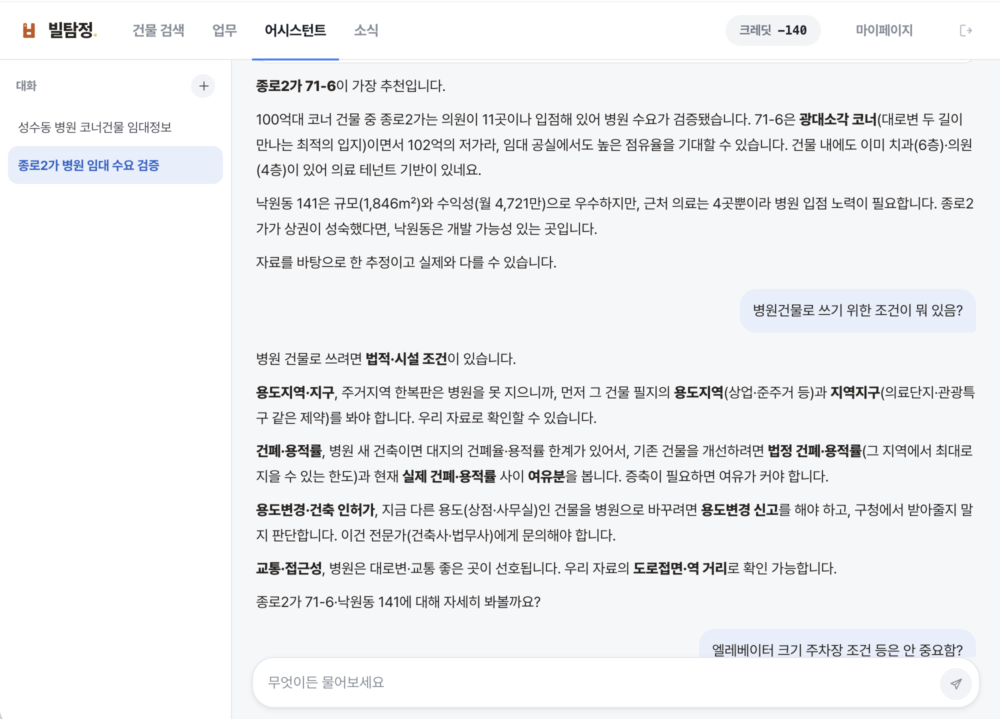
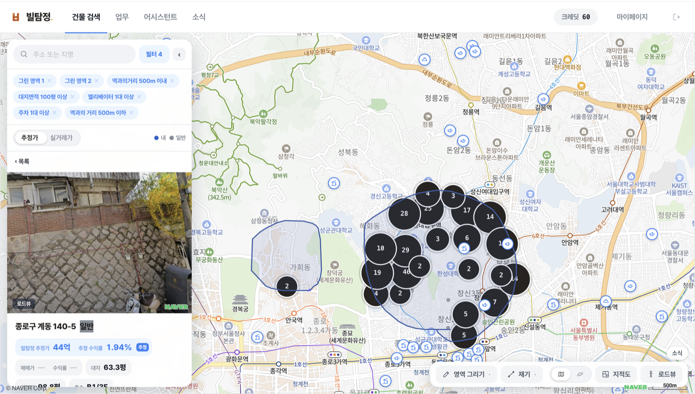
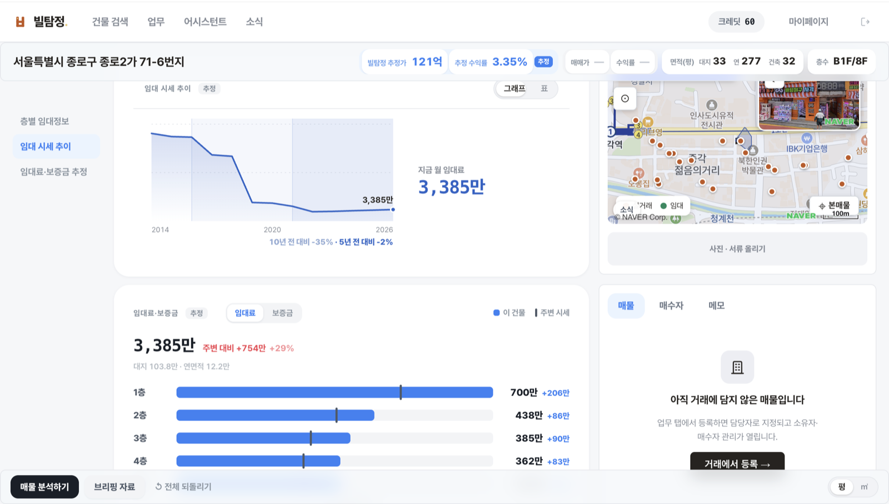
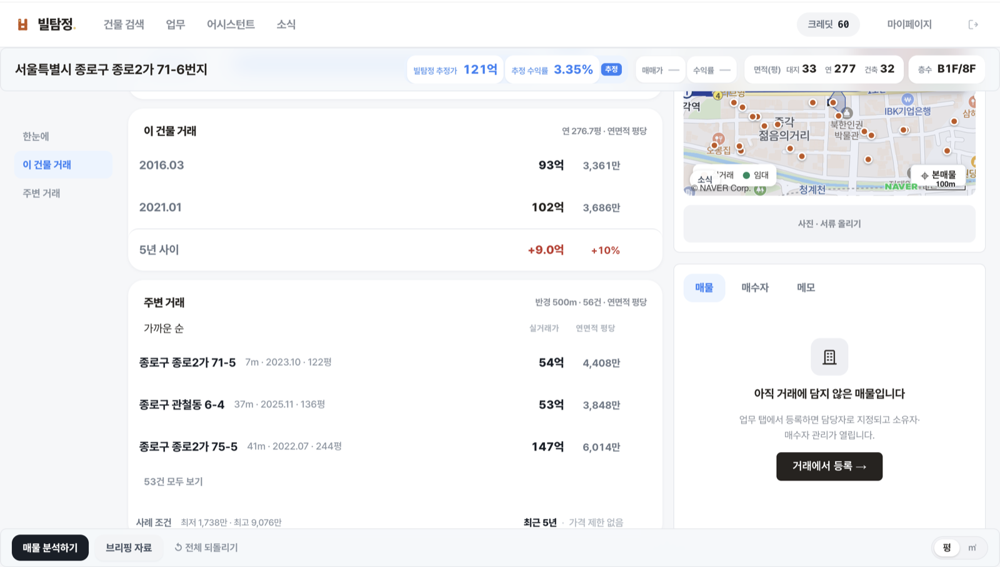
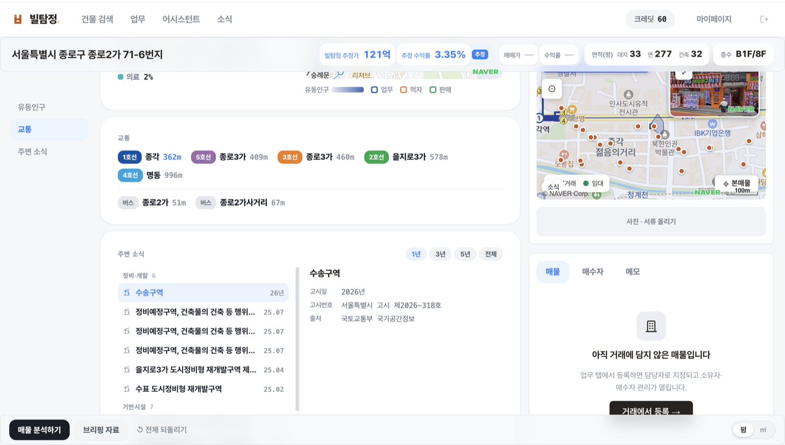

<p align="center">
  
</p>

<h3 align="center">서울 상업용 건물 60만 채를 분석하는 부동산 AI 서비스</h3>

<p align="center">
  <a href="#볼-만한-코드">볼 만한 코드</a> ·
  <a href="#주요-커밋">주요 커밋</a> ·
  <a href="#실행">실행</a> ·
  <a href="specs/">명세</a>
</p>

<p align="center">
  
  
  
  
  
  
  
</p>

## 왜 만들었나

상업용 부동산 시장의 가장 큰 리스크는 가격 불확실성임. 이 리스크는 정보 비대칭성과 낮은 거래 빈도라는
시장 특성에 의해 발생함. 이는 시장의 투자 심리를 저하시키며, 정보력이 부족한 개인은 리스크에 노출되기
더욱 쉬움. 실제로 이를 악용해 부당 이득을 취득하는 사례는 빈번하며, 건강한 시장을 위해선 이를 해결해야 함.

따라서 이 가격 불확실성 리스크를 해소할 수 있는 부동산 전문 AI 「빌탐정」을 시장에 공급하고자 함.
이는 부동산에 특화된 AI로 해당 분야에서 일반 AI보다 뛰어난 정보력과 문제 해결 능력을 가지고 있음.
그 근거는 서울 빌딩 60만 채의 모든 스펙을 실시간으로 분석하고 답하기 때문임. 빌탐정은 원하는 조건의
건물이 무엇인지, 구체적 건물 스펙, 장점과 단점, 합리적인 가격 범위 그리고 미래 수익성을 분석하고 답할 수
있음. 따라서 중개사는 건물의 합리적인 가격과 근거를 쉽게 제시할 수 있게 됨. 나아가 개인은 더 이상
정보력에 뒤처지지 않으며 리스크로부터 벗어날 수 있음.

## 핵심 기능

<p align="center">
  
</p>

**AI 어시스턴트**
「강남역 근처 30억 이하 수익률 5% 넘는 건물」처럼 말로 물으면, 질문을 검색 조건으로 바꿔 DB 를 직접 읽고
건물 목록과 근거를 답합니다. 답에 들어가는 숫자는 전부 DB 에서 가져온 값이라 출처와 단위가 붙어 있고,
DB 에 없는 값은 지어내지 않고 「없음」으로 둡니다.

## 기타 기능

**조건 검색**
용도, 연면적, 가격대, 수익률 같은 조건을 걸면 서울 전 건물 중 맞는 것만 남습니다. 결과는 왼쪽 목록과
오른쪽 지도에 동시에 표시되고, 조건을 바꾸면 둘 다 같이 바뀝니다.

**영역 그리기**
행정구역이 아니라 내가 보는 범위로 찾고 싶을 때, 지도에 직접 폴리곤을 그리면 그 안에 있는 건물만 보여
줍니다. 영역을 여러 개 그려도 앞에 그린 것이 지워지지 않아 골목 몇 개를 묶어서 볼 수 있습니다.

**가치 분석 보고서**
건물 하나를 고르면 그 건물의 실거래, 주변 실거래, 공시지가, 임대 시세를 모아 적정 매매가와 예상 임대료를
계산합니다. 숫자만 주는 것이 아니라 어떤 거래를 근거로 삼았는지 함께 보여 줘서 중개사가 그대로 고객에게
설명할 수 있습니다.

**상권 정의**
지도에 그린 범위를 상권으로 저장하고, 그 안의 유동인구와 업종 구성을 봅니다. 공공 데이터가 나눠 둔 상권이
아니라 중개사가 실제로 다루는 범위 기준입니다.

**입지 정보**
가까운 역과 버스 정류장까지의 거리, 유동인구, 그리고 반경 안의 정비구역 · 기반시설 고시를 한 화면에서
봅니다. 고시는 국토교통부 원문의 고시일과 고시번호를 그대로 붙입니다.

| | |
|---|---|
|  |  |
| 조건과 그린 영역으로 거른 검색 결과 | 임대 시세 추이와 층별 임대료 추정 |
|  |  |
| 이 건물 거래와 반경 500m 주변 거래 | 역 · 버스 거리와 주변 정비구역 고시 |

## 기술 스택

| 영역 | 선택 | 왜 |
|---|---|---|
| 프론트 | React · Vite · TypeScript · TanStack Query · Zustand | 로그인 뒤에 쓰는 업무 도구라 검색 노출이 필요 없고, 지도 · 캔버스 · 3D 는 브라우저에서만 돈다. 서버 렌더링(Next.js)을 두면 컨테이너만 늘어 SPA 로 갔다 |
| 백엔드 | FastAPI · asyncpg · JWT | 크롤링 · 적재 · 추정 산식이 전부 파이썬이라 언어를 하나로 묶었다 |
| DB | PostgreSQL · PostGIS | 필지 폴리곤을 그대로 저장한다. 지도에 그린 영역 안의 건물을 찾는 일이 `ST_Within` 한 줄로 끝난다 |
| 배포 | Docker · Firebase Hosting · Cloud Run · Terraform | 컨테이너 하나만 올리면 되고 DB 와 파일 저장을 같은 곳에 붙일 수 있다. 정적 호스팅의 rewrite 로 API 를 같은 도메인에 묶었다 |
| 검사 | Playwright · bash | 실제 화면을 열어 화면값과 DB 값을 대조한다 |

## 구조

```
frontend/   React + Vite + TypeScript · TanStack Query · Zustand
backend/    FastAPI · asyncpg · JWT
db/         PostgreSQL + PostGIS 마이그레이션
pipeline/   공공 데이터 수집 → 정제 → 적재 → 검증
infra/      Docker · Firebase Hosting · Cloud Run · Terraform
qa/         목적별 검사 (data · screen · mirror · build · ui) · run.sh 한 문
specs/      제품 · 데이터 · 아키텍처 명세 (정본)
```

## 볼 만한 코드

문제를 만나 고친 지점입니다. 링크가 실제 코드입니다.

- **필터 요구의 진짜 목적** — 중개사가 필터를 요구한 이유는 필터가 없어서가 아니라 원하는 건물을 찾고
  가격을 가늠하기 위해서였습니다. 실거래와 공시지가로 건물마다 적정가 · 임대료를 미리 계산해 두고
  그 값으로 찾게 했습니다. → [`pipeline/`](pipeline/)
- **지도 마커 수만 개** — 마커마다 DOM 을 만들자 화면이 멈춰, 캔버스 한 장에 그리고 `requestAnimationFrame`
  으로 프레임당 한 번만 갱신했습니다. 클릭 판정은 좌표 계산으로 대신합니다.
  → [`shared/map/mapCanvasLayer.ts`](frontend/src/shared/map/mapCanvasLayer.ts)
- **토큰 만료 때 동시 401** — 화면의 요청들이 같은 순간 재발급을 각자 불러 10여 건이 나갔습니다.
  진행 중인 재발급 하나를 공유해 한 건으로 줄였습니다.
  → [`shared/api/client.ts`](frontend/src/shared/api/client.ts)
- **잘려서 오는 AI 답변** — 서버가 SSE 로 보낸 조각을 네트워크가 임의로 잘라, 그대로 해석하면 답변 일부가
  사라졌습니다. 빈 줄을 만날 때까지 버퍼에 모아 온전해진 뒤 해석합니다.
  → [`features/assistant/api.ts`](frontend/src/features/assistant/api.ts)
- **첫 화면 번들 584KB 감소** — 3D 를 열지 않는 유저까지 three.js 를 받고 있어 `React.lazy` 로 별도 청크로
  뗐습니다. → [`features/building/LandScene.tsx`](frontend/src/features/building/LandScene.tsx)
- **필요한 검사만 돌리는 QA** — 검사가 일곱 갈래로 늘어 전부 돌리면 몇십 분이라 고칠 때마다 돌리지 못하게
  됐습니다. git diff 로 바뀐 경로를 읽어 그 경로를 맡는 갈래만 돌리고, 화면 검사는 Playwright 로 실제 화면을
  열어 화면값과 DB 값을 대조합니다. → [`qa/run.sh`](qa/run.sh) · [`qa/screen/qa_screen.py`](qa/screen/qa_screen.py)

## 주요 커밋

| 날짜 | 커밋 | |
|---|---|---|
| 07.05 | [초기 커밋: 와이어프레임 스펙 + 목업](../../commit/0ad5ac1) | 코드보다 스펙으로 시작 |
| 08.02 | [data.go.kr 자동 다운로더](../../commit/39ecf54) · [V-World 크롤러](../../commit/d03f125) | 원천 수집 자동화 |
| 08.04 | [GCP 배포 스크립트 · 런북](../../commit/309519c) | 배포 |
| 08.06 | [자동완성 4.6s → 0.15s](../../commit/786f042) · [검색 0.66 → 0.24s](../../commit/11d0678) | 성능 |
| 08.09 | [영역을 여러 개 그린다](../../commit/78b0606) | 고유 기능 |
| 09.01 | [대장 전국본을 버리고 서울본 55장으로](../../commit/df99903) | 데이터 재편 |
| 09.02 | [흩어진 검사를 qa/ 한 폴더로 · run.sh 한 문](../../commit/41a80ae) | 검사 자동화 |
| 09.08 | [AI 어시스턴트 1단계](../../commit/c166257) → [2단계](../../commit/cfe7335) | AI |

## 실행

```bash
docker compose -f infra/docker/docker-compose.yml up --build   # db:55432 · api:8000
cd frontend && npm install && npm run dev                        # http://localhost:5173
qa/run.sh                                                        # 바뀐 파일에 맞는 검사만
```

## 만든 사람

**이승욱** · coms1768@gmail.com · 2026.07 ~ 진행 중 · 기획 · 프론트엔드 · 백엔드 · 데이터 파이프라인 · 배포 단독
