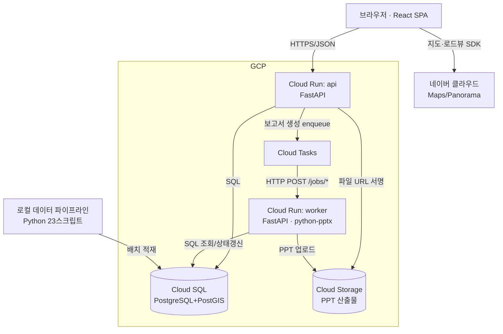

# 시스템 아키텍처 (v0)

> 앱 데이터 스키마(`04-data/schema-app.md`)와 화면 명세(`03-features/`)를 실제로 굴리기 위한 시스템 구성.
> 작성 2026-07-21. 근거 결정은 `06-review/플로우점검-2026-07.md`.

## 0. 스택 (확정)

| 레이어 | 선택 | 근거 |
|---|---|---|
| 백엔드 | **FastAPI** (Python) | 파이프라인·python-pptx·가치점수/적정매매가 산식이 전부 Python → 재사용. async·경량 |
| 프론트 | **React** (SPA) | S02 고밀도 화면·네이버지도 SDK. SEO 불필요(로그인 앱) |
| 배포 | **Docker → Cloud Run** | 사용자 확정 |
| DB | **Cloud SQL** (PostgreSQL 14+ **+ PostGIS**) | Postgres 확정 + 좌표(반경 검색·지적 폴리곤) |
| 파일 | **Cloud Storage (GCS)** | Cloud Run 로컬 비영속 → 생성 PPT 외부 저장 |
| 잡 큐 | **Cloud Tasks** | Cloud Run 네이티브. **Redis/Celery 불필요** |
| 지도 | **네이버 클라우드 Maps/Panorama** (프론트 SDK) | `네이버지도-연동.md` |

**규모 전제**: 목표 100명 · 서울 586,343동(읽기 위주) · 실거래 51.7만건. **초대용량 아님** → 단순 구성으로 충분.

---

## 1. 시스템 구성도



- **api 서비스**와 **worker 서비스**는 **같은 코드베이스, 다른 Cloud Run 서비스**로 배포한다(엔트리포인트만 다름). 워커는 Cloud Tasks만 호출하고 외부에 노출하지 않는다(인증 토큰).
- 프론트(React 정적 번들)는 **별도 Cloud Run 또는 GCS+CDN**으로 서빙(§5).

---

## 2. 데이터 레이어 — 마스터 vs 앱 (아키텍처의 핵심)

**같은 Cloud SQL 인스턴스, 스키마 2개로 분리한다.**

| 스키마 | 내용 | 쓰기 주체 | 갱신 |
|---|---|---|---|
| `master` | 건물·필지·공시지가·실거래·교통·규제 (586,343동) | **파이프라인만** (배치) | 부정기(공시지가 연 1회 등) → `master_version` |
| `app` | 계정·팀·오버레이·매물등록·크레딧·위키·산출물 (`schema-app.md`) | **API** (실시간) | 상시 |

- [규칙] **API는 `master`를 읽기만** 한다. 유저 수정은 `app.overlays`로 덮는다(마스터 불변 원칙, `S02 §1.1`).
- [규칙] **화면값 = master 조인 app.overlays.** 대부분 건물은 오버레이가 없으므로 LEFT JOIN 후 COALESCE.
- 분리 이유: 마스터는 대용량·읽기전용·배치 갱신이고 앱은 소용량·읽기쓰기·상시다. 성격이 완전히 다르지만, 100명 규모에 인스턴스를 2개로 나누는 건 과설계 → **한 인스턴스 · 두 스키마**가 최적점.

---

## 3. 핵심 흐름 3개

### 3.1 화면 조회 = 마스터 + 오버레이 병합
```
GET /buildings/{pk}
  1. master.buildings + parcels + 시계열 조회
  2. app.overlays WHERE team_id=? AND target IN (건물, 필지들) 조회
  3. 필드별 COALESCE(overlay.value, master.value) → 응답
  4. 사적 레이어(listings 업무·floor_rents·memos)는 team_id로 별도 조회
```
- **수정이력 분포**(§4.3) = `app.overlays`를 공공 필드에 한해 **익명 GROUP BY** (작성자 제외). 별도 테이블 없음.

### 3.2 보고서 비동기 생성 (Cloud Tasks)
```
[API]  POST /reports  (kind, building_pk, options)
        → app.reports INSERT (status=대기)
        → Cloud Tasks enqueue { report_id }
        → 202 Accepted + report_id 반환   ← 즉시 응답

[Task] Cloud Tasks → POST /jobs/generate-report  (worker)
        → status=생성중
        → master+overlay+S03 curation 조립 → 가치점수(F-16)·적정매매가(F-17) 산출
        → python-pptx로 PPT 생성 → GCS 업로드
        → status=완료, file_path=gs://..., source_watermark 기록
        → 크레딧 차감(성공 트랜잭션 안에서)   ← "성공 시 차감"

[Front] report_id 폴링 → status=완료 → 서명 URL로 자동 다운로드
```
- **실패**: worker 예외 → status=실패, failed_reason 기록, **크레딧 미차감**. Cloud Tasks 자동 재시도는 **끄거나 1회**로 제한(중복 생성 방지).
- **알림 불필요**: 프론트 폴링 + 이탈해도 `내 산출물`에 남음(`R-보고서 §2a`).

### 3.3 S03 주변시세 = 반경 내 전 팀 comps (PostGIS)
```
POST /market/nearby  (center_lat, center_lng, radius_m, floor_range)
  임대 comps: SELECT ... FROM app.floor_rents fr
              JOIN master.buildings b ON b.pk=fr.building_pk
              WHERE ST_DWithin(b.geom, ST_Point(?,?)::geography, ?)   ← PostGIS
  실거래 comps: master의 추정 실거래이력에 동일 반경 쿼리
  → 원본 행 그대로 반환(병합·다수결 없음), 이상치 플래그만 부착
```
- **floor_rents는 사적(팀 소유)이지만 S03 조회는 전 팀** — "저장은 사적, 조회는 공용"(`F-01` B안). 정제는 프론트에서 curation.
- PostGIS `GIST(geom)` 인덱스 필수.

---

## 4. 관통 결정이 아키텍처에 박히는 지점

| 결정 | 아키텍처 반영 |
|---|---|
| 팀 내 배타적 선점 | `app.listings` **부분 UNIQUE 제약** (DB 레벨 강제) |
| 크레딧 음수 허용(베타) | **DB CHECK 없음** + 서비스 계층 게이트 (환경변수 플래그) |
| undo/redo 폐기 | 서버에 편집 스택 없음. 되돌리기 = `overlays` row DELETE |
| 산출물 불변 이력 | `reports.parent_id`, 파일은 GCS에 버전별 보관 |
| 1인팀 자동 생성 | 가입 트랜잭션에 teams INSERT 포함 → `team_id` 항상 존재 |
| 신선도 판정 | `reports.source_watermark` vs 현재 `max(updated_at)` 비교 (인덱스 조회 1회) |

---

## 5. 배포 토폴로지

```
Firebase Hosting: web  (React 정적 · CDN)  ─ rewrite /api/** ─▶ Cloud Run api
Cloud Run: api         (공개, 인증=JWT)   min-instances=1  ← 콜드스타트 완화
Cloud Run: worker      (비공개, Cloud Tasks OIDC)          min-instances=0  ← 유휴 시 0
Cloud SQL: postgres+postgis   (master·app 2스키마)
Cloud Storage: 산출물 버킷 (서명 URL로만 접근)
Cloud Tasks: report-queue
Secret Manager: 네이버 키·DB 비번·JWT 시크릿·SMS(정식)
```
- **오리진 통일**: 프론트와 api가 같은 도메인(Firebase Hosting rewrite)이라 CORS 불필요, 리프레시 토큰을 httpOnly 쿠키로 안전하게 쓸 수 있다(§9).
- [확정 2026-07-21] **api min-instances = 1** — 업무시간 상시 사용하는 도구라 콜드스타트(2~5초·Python+DB풀)가 UX 저해. 소형 인스턴스 1개 상시 대기 비용은 감수. worker = 0(유휴 시 0).
- [확정 2026-07-21] **프론트 = Firebase Hosting(정적 CDN) + rewrite 프록시** — React 정적 번들은 CDN이 최적. `/api/**` → Cloud Run api로 **rewrite**해 같은 오리진으로 서빙(CORS 회피). Cloud Run web 서비스 별도 불필요.

---

## 6. 파이프라인 → 프로덕션 적재

- 현재 파이프라인은 로컬에서 **CSV + SQLite(강남.db)** 산출. 프로덕션은 Cloud SQL.
- [규칙] 적재 = 파이프라인이 만든 CSV를 **Cloud SQL에 COPY**(또는 배치 스크립트). `master` 스키마만 건드린다.
- [규칙] 적재 시 **`master_version` 갱신** → 그 시점 이후 기존 보고서는 "데이터 변경됨"(신선도 판정).
- [규칙] 무중단: 새 버전을 별도 테이블/스키마에 적재 후 **원자적 스왑**(view 재지정 등). 100명 규모면 짧은 점검창도 허용.
- [열림] 서울 전역 확장 시 적재 시간·인덱스 재생성 비용 — 강남만으론 미검증.

---

## 7. 열린 결정 → 확정 (2026-07-21)

| # | 항목 | 결정 |
|---|---|---|
| A-1 | api min-instances | **1** (콜드스타트 UX) · worker 0 |
| A-2 | 프론트 서빙 | **Firebase Hosting + rewrite 프록시** (같은 오리진) |
| A-3 | 인증 상세 | **JWT access(30분) + refresh(httpOnly 쿠키, 30일)**. 전화인증 [정식] (§9) |
| A-4 | master 무중단 스왑 | **staging 스키마 적재 → view 원자 재지정**. 베타는 짧은 점검창 허용 (§6) |
| A-5 | 파이프라인 클라우드화 | **확정(2026-07-21): 베타부터 완전 자동** — Cloud Scheduler + Cloud Run Job(pipeline·loader). 상세 = [[01-상세설계]] §2 |
| A-6 | 관측성 | **Cloud Logging + Sentry**(에러 추적, 무료 티어부터) |
| PPT 지도 | **해결**: 네이버 **Static Map API**(REST, 서버측) → GCS. worker가 보고서 생성 시 호출 |

---

## 8. API 표면 (초안)

REST/JSON. 모든 엔드포인트는 JWT 필요(§9), `team_id`는 토큰에서 도출 — 클라이언트가 못 바꾼다.

| 그룹 | 엔드포인트 | 비고 |
|---|---|---|
| 인증 | `POST /auth/signup` `POST /auth/login` `POST /auth/refresh` `POST /auth/logout` | 가입 트랜잭션에 teams INSERT(1인팀) 포함 |
| 검색 | `POST /search`(q·filters·**polygon(GeoJSON)**) · `GET /search/suggest?q=` | 무크레딧. polygon 있으면 `ST_Within`으로 영역 검색(영역 그리기, S01 §3.6c · PostGIS GIST). suggest=주소 자동완성(master 주소 인덱스, 접두검색) |
| 건물 | `GET /buildings/{pk}` | master+overlay 병합(§3.1). 필지·시계열 포함 |
| 오버레이 | `PUT /buildings/{pk}/fields/{field}` `DELETE …`(되돌리기) | 자동저장(넛지 없음). app.overlays upsert/delete |
| 매물 | `POST /listings`(담당자 지정=선점) `PATCH` `DELETE`(해제) | 부분 UNIQUE로 팀 내 배타 선점 강제 |
| 층별임대 | `GET/POST/PATCH /buildings/{pk}/floor-rents` | 저장=사적, 조회(S03)=전 팀 |
| 주변시세 | `POST /market/nearby` | PostGIS 반경 comps(§3.3) |
| 광고가 | `POST /buildings/{pk}/ad-prices` | 집단지성 공용 |
| 위키·메모 | `GET/POST /buildings/{pk}/wiki` `…/memos` | 메모 2종(팀/비밀) |
| 보고서 | `POST /reports`(202+id) · `GET /reports/{id}`(폴링) · `GET /reports`(내 산출물) | 비동기(§3.2). 완료 시 서명 URL |
| 워커(내부) | `POST /jobs/generate-report` | Cloud Tasks OIDC만. 외부 비노출 |
| 크레딧 | `GET /credits`(잔액·버킷) · `GET /credits/entries`(원장) | 성공 시 차감(§4) |

---

## 9. 인증 · 보안

- **토큰**: access(JWT, ~30분, Authorization 헤더) + refresh(httpOnly·Secure 쿠키, ~30일, 회전). 같은 오리진(§5)이라 쿠키 CSRF는 SameSite=Lax + 상태변경은 헤더 토큰 요구로 방어.
- **팀 격리**: 모든 사적 데이터(listings 업무·memos·favorites·credits)는 `team_id`/`user_id` 스코프. `team_id`는 **토큰에서만** 도출(요청 파라미터 무시) — 남의 팀 데이터 접근 원천 차단.
- **전화번호 마스킹**: 소유자 전화 등 민감값은 응답에서 마스킹, 열람은 권한·감사 대상([정식] 감사로그).
- **산출물**: GCS 직접 공개 금지, **서명 URL**(단기)로만. 보고서는 생성 팀만.
- **전화번호 인증(SMS)** = [정식]. 베타는 이메일+비번(최소 인증). 1번호=1계정 어뷰징 방어는 정식에서.
- **시크릿**: 네이버 키·DB 비번·JWT 시크릿·SMS 키 = Secret Manager. 코드/이미지에 미포함.
- **크레딧 게이트**: 음수 허용(베타 플래그)이나 서비스 계층에서 차단 로직 보유 — 정식 전환 시 CHECK 추가.

---

*v1 · 2026-07-21 · 스택 확정 + 배포/인증/API 표면 확정. 남은 것은 착수 시 IaC·스키마 마이그레이션 구체화.*
